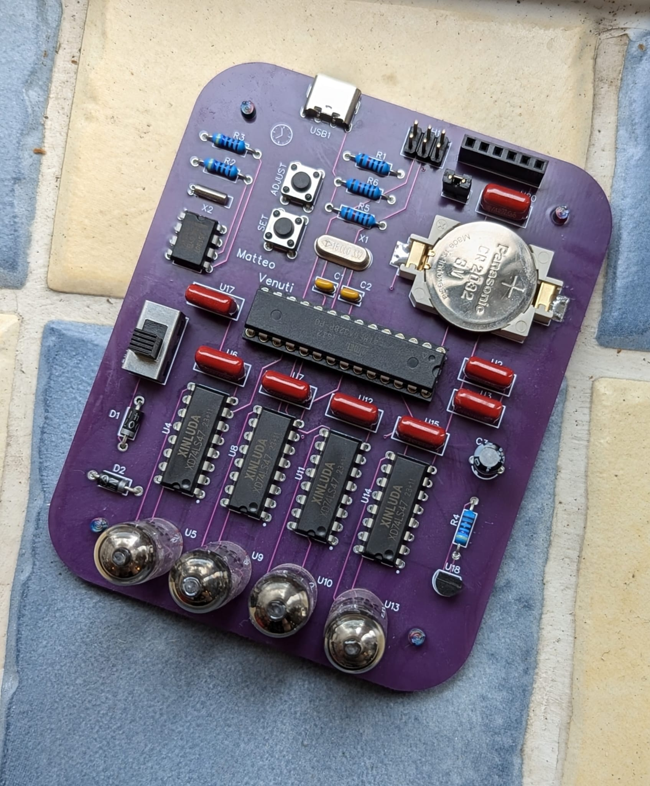
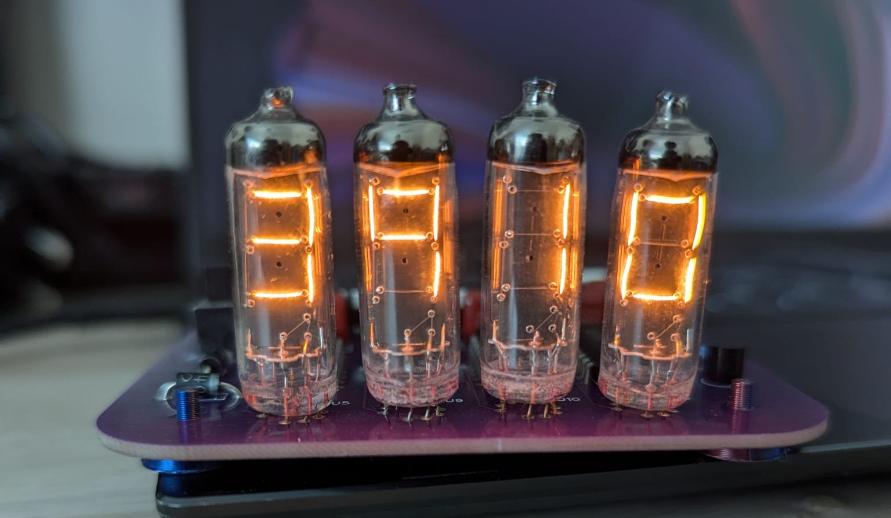

# IV-9-Clock

This was a short project that I completed over the Easter break, I had wanted a clock to put on my desk and happened to have some IV 9 numitron tubes from Ukraine that I hadn't used for years. 

### The Journey

This was a relatively short project, the idea was to make a simple circuit consisting of an AVR microcontroller, RTC module and some BCD to 7-segment drivers to control the numitrons.

Numitron tubes are a vintage technology, a type of 7-segment display that uses the same technique as incandescent light bulbs to produce light. Despite the inherent disadvantages of using numitrons over something like LEDs, they have an oddly appealing glow (and look pretty cool). There are eight elements (that are needed to display all 10 digits) in each numitron, these can be reduced from 32 control signals to 16 using BCD to 7-segment decoders. However, since these are numitrons each tube draws a few hundred milliamperes at full power. For this reason the 74LS47 was chosen to drive each numitron, as it has a sink current of 40mA on its outputs, which should be sufficient to drive each tube.

For simplicity an ATMEGA328P, the same microcontroller in the Arduino Uno, was used as I could just burn the Arduino bootloader on to it and use a premade library for the clock module. Which ended up being the DS1307N, along with an external coin cell battery for time keeping. The project took less than two weeks to design, order, build and code.

It's a very pleasing sight and a great conversation starter, however there were some major issues that need to fixed. For starters, the board has a switch and two diodes used to dim the numetrons. A quick and dirty method to make sure the clocks' display wasn't always at full power. However, the small and somewhat low current diodes heat up due to the large current draw of the numitrons. Perhaps some sort of triac would be more appropriate? Furthermore, I did not add pull down resistors on the CC pins of the USB C connector, so the clock can only be powered by questionable USB C power supplies from places like aliexpress... Despite the drawbacks it was a fun and simple project, if I have some time I can also write some code for the temperature sensor.
